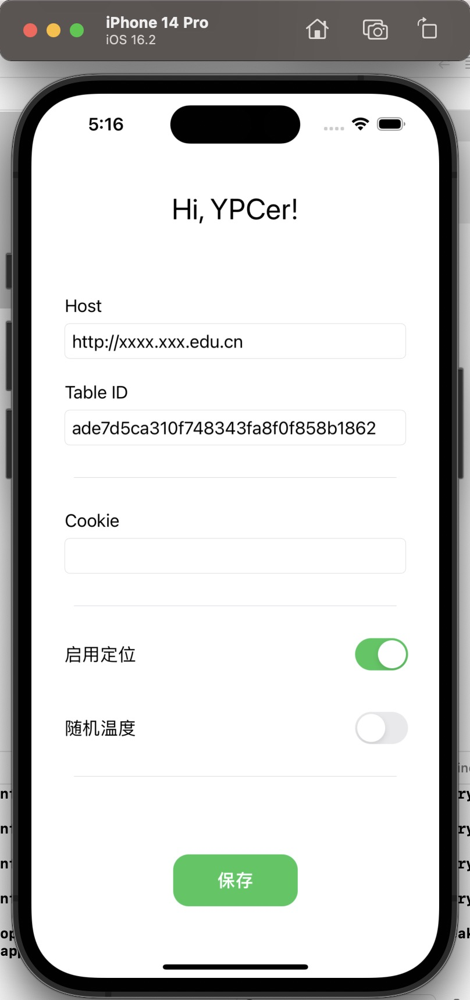

#  YPC Helper

YPC 健康助手，利用SiriKit实现每日打卡，解放双手。

## Feature

- 定位跟随手机，手机移动，打卡位置自动更新
- 随机范围体温

## Compatibility

✅ Only test in iOS 16.2, iPhone 14 Pro

## Usage

1. ~~下载安装~~ 苹果审核政策，暂无法下载安装，需要自行编译安装
2. 打开应用，授权位置权限
3. 填写参数，点击保存
3. 打开捷径，设置快捷指令
    
    选择App -> YPC Helper -> 执行任务
    选择通知 -> 显示通知

4. 添加自动化，设置每日定时任务 
5. 解放双手

## Note

稀烂的代码，仅供参考，不保证可用性。

## License

None

## Preview

